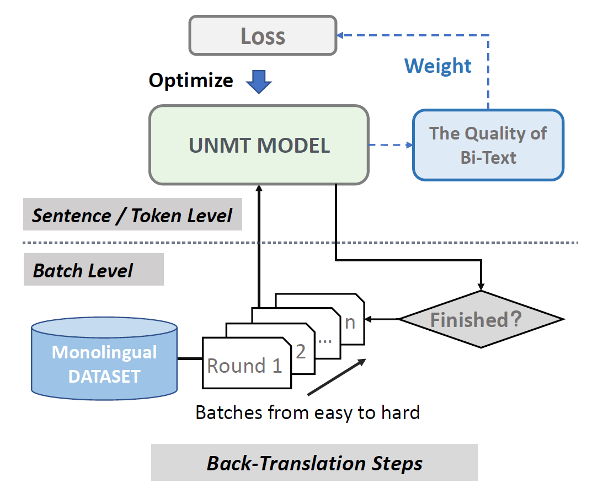

### Exploiting Curriculum Learning in Unsupervised Neural Machine Translation

-------------------------------------------

This is the repo for EMNLP2021-Findings paper - "Exploiting Curriculum Learning in Unsupervised Neural Machine Translation"

#### Introduction

---------------------------------------------------------------

This paper exploits curriculum learning (CL) in unsupervised neural machine translation (UNMT). Specifically, we design methods to estimate the quality of pseudo bi-text and apply CL framework to improve UNMT. Please refer to the paper for more details.



#### Dependencies

----------------------------------------------------------------

- Python 3
- [NumPy](http://www.numpy.org/)
- [PyTorch](http://pytorch.org/)
- [fastBPE](https://github.com/facebookresearch/XLM/tree/master/tools#fastbpe) (generate and apply BPE codes)
- [Moses](https://github.com/facebookresearch/XLM/tree/master/tools#tokenizers) (scripts to clean and tokenize text only - no installation required)
- [Apex](https://github.com/nvidia/apex#quick-start) (for fp16 training)

#### Train an UNMT model

--------------------------------------------------

This repo is modified based on [XLM toolkit](https://github.com/facebookresearch/XLM) and [MASS](https://github.com/microsoft/MASS). You can run the model through following commands.

For XLM:

```
bash run_unmt_ende.sh
```

For MASS:

```
bash CL_MASS/run_unmt_enro.sh
```

If you have multiple GPUs, please modify the scripts according to [XLM README](https://github.com/facebookresearch/XLM)

#### Difficulty File Prepare

-------------------------------------------------------

We would upload the python scripts which used for difficulty computation.

#### Pre-trained Language Models

For en-de, en-fr, en-ro, please download from [XLM README](https://github.com/facebookresearch/XLM) and [MASS README](https://github.com/microsoft/MASS).

For en-zh, our model can be download through the following link.

| Link                                            | Password |
| ----------------------------------------------- | -------- |
| https://pan.baidu.com/s/1vTQDjWF119EITVIHew-leA | tkvn     |

#### Reference

---------------------------------------

```
@article{lu2021,
  title={Exploiting Curriculum Learning in Unsupervised Neural Machine Translation},
  author={Jinliang, Lu and Jiajun, Zhang},
  booktitle={Findings of the Empirical Methods in Natural Language Processing: EMNLP 2021},
  year={2021}
}
```
